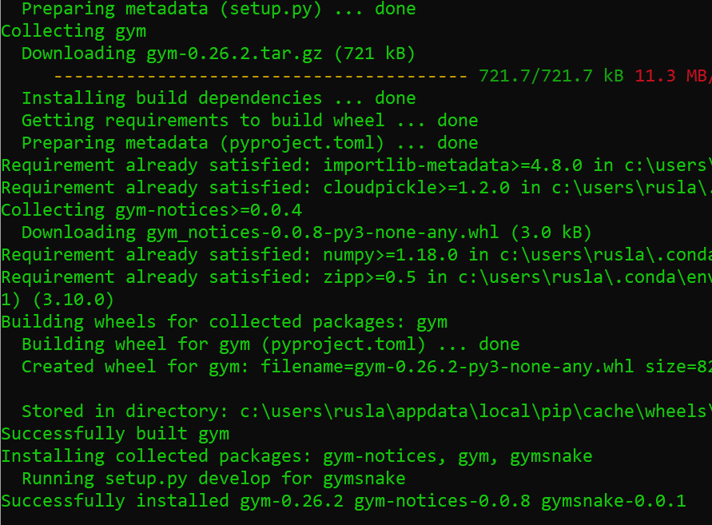
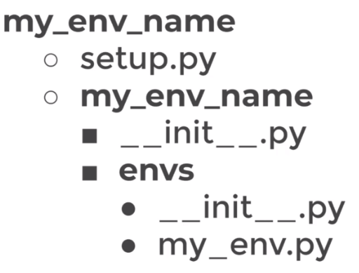
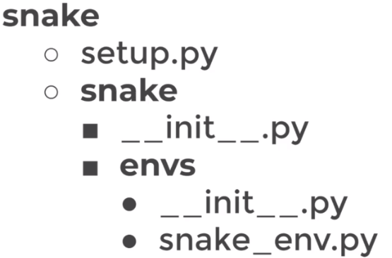
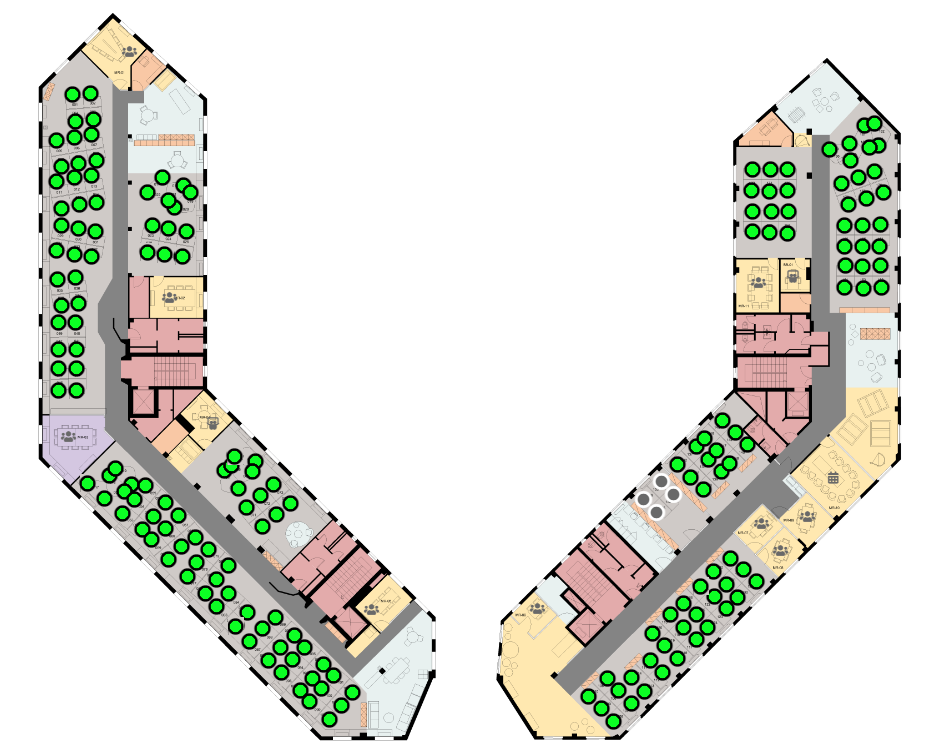
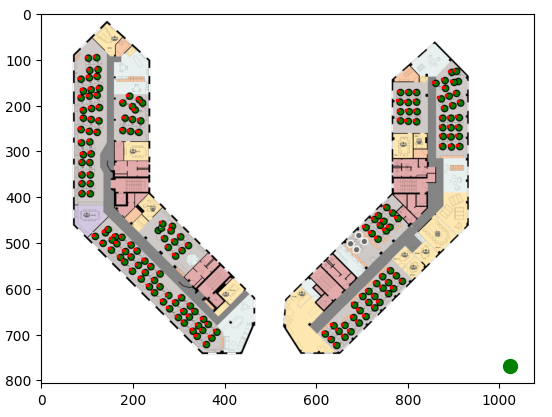
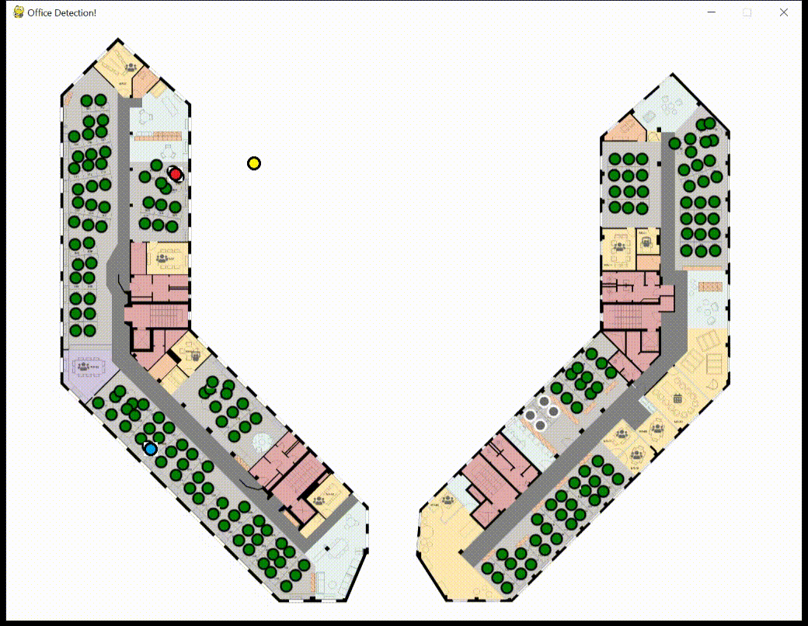
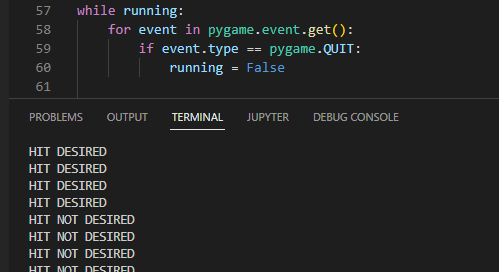
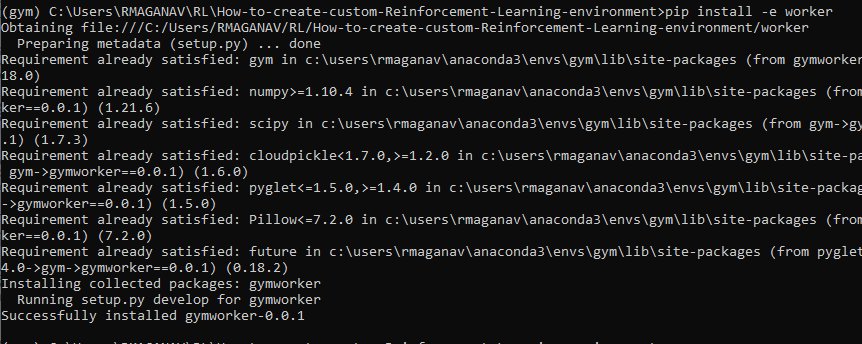

# How to create a custom Reinforcement Learning Environment in Gym


## Step 1. Creation of  Python environment

I will create an environment called **gym**, because we are interested in the **Gymnasium** library.

Gymnasium is **an open source Python library for developing and comparing reinforcement learning algorithms** by providing a standard API to communicate between learning algorithms and environments, as well as a standard set of environments compliant with that API. 

First you need to install anaconda at this [link](https://www.anaconda.com/products/individual)

then after is installed type in your terminal

```
conda create -n gym python==3.8 gym==0.18.0 
```

then

```
conda activate gym
```

then we install the following libraries

pip install --upgrade setuptools.

```
pip install extras_require keras notebook  pygame matplotlib tensorflow  keras-rl2 ray pandas dm_tree opencv-python seaborn scipy tensorflow_probability torch
```

```
pip install ray[tune]  lz4
```

```
pip install stable-baselines3==1.4.0
```

nstall stable-baselines3

then in your terminal type the following commands:

```
conda install ipykernel
```

then we install

```
python -m ipykernel install --user --name gym --display-name "Python (Gym)"
```

and then  we clone our repository

```
git clone https://github.com/ruslanmv/How-to-create-custom-Reinforcement-Learning-environment.git
```


```
cd How-to-create-custom-Reinforcement-Learning-environment
```

```
pip install -e snake
```




then we type

```
jupyter notebook
```


and we choose our Python (Gym) notebook


If you want to uninstall your environment

```
conda env remove -n gym
```

and by typing

```
jupyter kernelspec list
```

 to get the paths of all your kernels.
Then simply uninstall your unwanted-kernel

```
jupyter kernelspec uninstall gym
```


# Creating an Open AI Gym Environment

Once is loaded the Python (Gym) kernel  you can open the example notebooks.

The first notebook, is simple the game  where we want to develop the appropriate environment

 [0-Custom-Snake-Game.ipynb](https://github.com/ruslanmv/How-to-create-custom-Reinforcement-Learning-environment/blob/master/0-Custom-Snake-Game.ipynb)


The second notebook is an example about how to initialize the **custom environment,**

[snake_env.py](https://github.com/ruslanmv/How-to-create-custom-Reinforcement-Learning-environment/blob/master/snake/snake/envs/snake_env.py)

where it  has the structure



in our case 



[1-Creating-a-Gym-Environment.ipynb](https://github.com/ruslanmv/How-to-create-custom-Reinforcement-Learning-environment/blob/master/1-Creating-a-Gym-Environment.ipynb)

and finally the third notebook is simply an application of the Gym Environment into a RL model.

[2-Applying-a-Custom-Environment.ipyn](https://github.com/ruslanmv/How-to-create-custom-Reinforcement-Learning-environment/blob/master/2-Applying-a-Custom-Environment.ipynb)


# Custom office game


We are interested to build  a program that will find the best desktop .

The first program is the game where will be developed the environment of gym.

[12_many_office_detection.py](https://github.com/ruslanmv/How-to-create-custom-Reinforcement-Learning-environment/blob/master/custom_game/basics_py/12_many_office_detection.py)


After is cloned this repo , open with  in **Visual Studio Code**

```
code .
```

you can open the program

```
How-to-create-custom-Reinforcement-Learning-environment\custom_game\12_many_office_detection.py
```

make sure you have the **Gym** environment


run this program by pressing **ctrl+F5** 


and move with the arrows the desired desktop.


## Manual Generator of coordinates

On Python >= 3.6, you can also try this command:

```
pip install pyqt5
```

Let us assume that we want to get the coordinates of seats of one building. There are several places marked with green points.

We can determine the coordinates with the following program

[Tool-Pixel-1.ipynb](https://github.com/ruslanmv/How-to-create-custom-Reinforcement-Learning-environment/blob/master/custom_game/Tool-Pixel-1.ipynb)

we can get the list of coordinates of seats of the map.


## Automatic Generator of coordinates

Let us assume that you have a different setup of seats, so in order to identify the green circles we can use open cv

```
pip install opencv-python
```

In this program [Tool-pixel-3.ipynb](https://github.com/ruslanmv/How-to-create-custom-Reinforcement-Learning-environment/blob/master/custom_game/Tool-pixel-3.ipynb)

we can find the all the seats



Then we find all the centers of those contours



That will be the positions of our game

and can be loaded by  the command

```python
import pickle
with open('seats.pkl', 'rb') as f:
    mynewlist = pickle.load(f)
```

# Office Seat Game

The following code, gives the game to select the seat. The person is the yellow circle.

The red circles, the desired, and the blue ones, the not desired.

[14_seat_office.py](https://github.com/ruslanmv/How-to-create-custom-Reinforcement-Learning-environment/blob/master/custom_game/basics_py/14_seat_office.py)




Each time you arrive to the red circles you got the **hit desired** goal otherwise is  **hit not desired**:



The next step is create the gym environment by using this game.


#  Custom Environments

# File Structure

## Introduction

The main OpenAI Gym class. It encapsulates an environment with arbitrary behind-the-scenes dynamics. An environment can be partially or fully observed.  The main API methods that users of this class need to know are:

- ​        step
- ​        reset
- ​        render
- ​        close
- ​        seed


And set the following attributes:

**action_space**: The Space object corresponding to valid actions

 **observation_space**: The Space object corresponding to valid observations

 **reward_range**: A tuple corresponding to the min and max possible rewards


Note: a default reward range set to [-inf,+inf] already exists. Set it if you want a narrower range.
The methods are accessed publicly as "step", "reset", etc.. The non-underscored versions are wrapper methods to which we may add functionality over time.


If you try doing a custom environment from the [official guide](https://github.com/openai/gym/blob/master/docs/creating-environments.md), chances are, you will start with building this file structure:

```
gym-basic/
  setup.py
  gym_basic/
    __init__.py
    envs/
      __init__.py
      basic_env.py
      basic_env_2.py
```

In this example, we are setting up an environment called *basic*, and do two versions of it. Naturally, just change the string to whatever you want to call your environment.

## **gym-basic/setup.py**

```python
from setuptools import setup 
setup(name=’gym_basic’, version=’0.0.1', install_requires=[‘gym’] )
```

## **gym-basic/gym_basic/__init__.py**

```python
from gym.envs.registration import register
register(id='basic-v0',entry_point='gym_basic.envs:BasicEnv',) 
register(id='basic-v2',entry_point='gym_basic.envs:BasicEnv2',)
```

(We will have two environments, `BasicEnv`, with `id = 'basic-v0'`, and `BasicEnv2`, with `id = basic-v2`. This way, you can keep different versions of the environment in the same registry.)

## gym-basic/gym_basic/envs/__init__.py

```
from gym_basic.envs.basic_env import BasicEnv
from gym_basic.envs.basic_env_2 import BasicEnv2
```

## gym-basic/gym_basic/envs/basic_env.py

```python
import gym
from gym import error, spaces, utils
from gym.utils import seeding

class BasicEnv(gym.Env):
    metadata = {'render.modes': ['human']}

    def __init__(self):
        # There are two actions, first will get reward of 1, second reward of -1. 
        self.action_space = spaces.Discrete(5)
        self.observation_space = spaces.Discrete(2)

    def step(self, action):

        # if we took an action, we were in state 1
        state = 1
    
        if action == 2:
            reward = 1
        else:
            reward = -1
            
        # regardless of the action, game is done after a single step
        done = True

        info = {}

        return state, reward, done, info

    def reset(self):
        state = 0
        return state
  
    def render(self, mode='human'):
        pass

    def close(self):
        pass

```

## gym-basic/gym_basic/envs/basic_env2.py

```python
import gym
from gym import error, spaces, utils
from gym.utils import seeding
import numpy as np

# same as BasicEnv, with one difference: the reward for each action is a normal variable
# purpose is to see if we can use libraries

class BasicEnv2(gym.Env):
    metadata = {'render.modes': ['human']}

    def __init__(self):
        # There are two actions, first will get reward of 1, second reward of -1. 
        self.action_space = spaces.Discrete(5)
        self.observation_space = spaces.Discrete(2)

    def step(self, action):

        # if we took an action, we were in state 1
        state = 1
        reward = np.random.normal(loc = action, scale = action)
            
        # regardless of the action, game is done after a single step
        done = True

        info = {}

        return state, reward, done, info

    def reset(self):
        state = 0
        return state
  
    def render(self, mode='human'):
        pass

    def close(self):
        pass

```

## How to Register your Environment

As long as you have the corresponding environment files in the `envs` folder (`basic_env.py` and `basic_env_2.py` in our case), you can register your environment. Just navigate up in your terminal to the folder that contains `gym-basic`, and use `pip`:

```
pip install -e gym-basic
```

If you update the environment `.py` files later, it should update your environment automatically.

All right, we registered the Gym environment. We can finally concentrate on the important part: the environment class.

## What you Need in a Gym Environment

- The environment needs to be a class inherited from `gym.Env`.
- In `**__init__**`, you need to create two variables with fixed names and types. **You need a** `**self.action_space**`**, and a** `**self.observation_space**`. These two need to be of Gym’s special class, `space`, which is not outright tricky, but not entirely straightforward either. Have a look at the [documentation](https://gym.openai.com/docs/#spaces), there are basically two types: a one-dimensional called `Discrete`, and an n-dimensional called `Box`. In this example, we will keep things simple and only use `Discrete`. (One could argue that you can always re-code your spaces to one-dimensional id codes.)
- The `**reset**` function returns a value that is within `**self.observation_space**`. This is the function that will re-start the environment, for example, at the beginning of a game. In my environments, I call the variable that keeps track of the current state… well, `state`, but there is no restriction there, you can call it whatever. If we use a `Discrete` observation space, this `state` value needs to be an integer. With a `Box`, it can be a `numpy.array`.
- The `**step**` function has one input parameter, needs an action value, usually called `action`, that is within `**self.action_space**`. Similarly to `state` in the previous point, `action` can be an integer or a `numpy.array`. This is the response function, the agent provides the action they want to take, and the environment returns the state it brought them to. The return value is a 4-tuple, in the following order (the naming does not matter, but the variable type does):
  \- `**state**`, same type of variable as the return of the reset function, of `**self.observation_space**`;
  \- `**reward**`, a number that informs the agent about the immediate consequences of its action;
  \- `**done**`, a boolean, value that is TRUE if the environment reached an endpoint, and should be reset, or FALSE otherwise;
  \- `**info**`, a dictionary that can be used in bug fixing, and as far as I know, the baselines algorithms don’t use it.
  You need to provide these variables, but they don’t all have to have “proper“ values. For example, the `**info**` can be just an empty dictionary.

It’s important to note that **you can have as many helping functions within your class as you want**, and it doesn’t matter what you call them, as long as they don’t use any of the reserved names.

## Environment Example

# Custom Environment Creation

Once the custom environment were created 

```
pip install -e worker
```





```
C:.
├───gymworker.egg-info
└───worker
    └───envs
```

